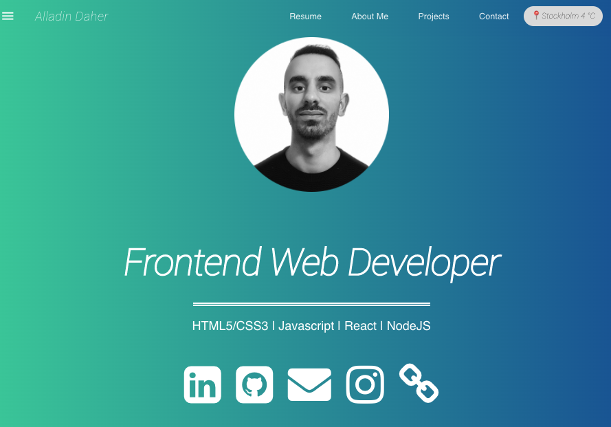

# Personal portfolio site (V.1)
For this project I created my first personal portfolio site to practice React, original created by Paul Hanna's youtube series. 
Put my own touch and created own things along like calling an API weather from my current city & contact form. 

This is a template portfolio. My actuall portfolio is [here](https://www.alladindaher.se/)

## Demo
- [Link](https://ad757.surge.sh)

## Screenshoot

### React-portfolio-starter
A React based personal portfolio app using create-react-app and React Router v4.

# Tools
* create-react-app cli
* React MDL material design
* React Router v4

# Start App
* Clone repo
* npm install
* npm start
