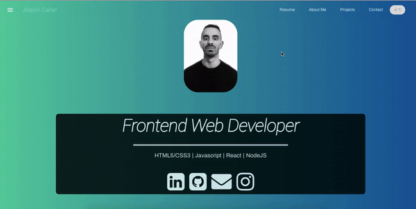

# Personal portfolio site
For this project I created a personal portfolio site with an API weather call. 

# Resources
React Components and layout from React-MDL.

# Screenshoot

# react-portfolio-starter
A React based personal portfolio app using create-react-app and React Router v4.

# Tools
* create-react-app cli
* React MDL material design
* React Router v4

# Start App
* Clone repo, install, cd into folder and run:
* npm install
* npm start

## Demo
(https://ad757.surge.sh)
